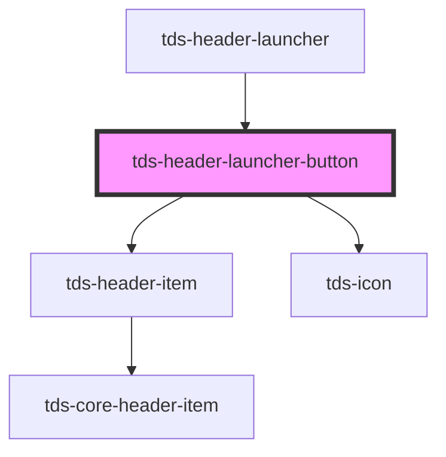

# tds-header-launcher-button

<!-- Auto Generated Below -->

## Properties

| Property | Attribute | Description                                                                                                                      | Type      | Default |
| -------- | --------- | -------------------------------------------------------------------------------------------------------------------------------- | --------- | ------- |
| `active` | `active`  | If the button should appear active. Can be used when the button is triggering a dropdown, and the dropdown is open, for example. | `boolean` | `false` |

## Dependencies

### Used by

 - [tds-header-launcher](../header-launcher)

### Depends on

- [tds-header-item](../header-item)
- [tds-icon](../../icon)

### Graph

----------------------------------------------

*Built with [StencilJS](https://stenciljs.com/)*
