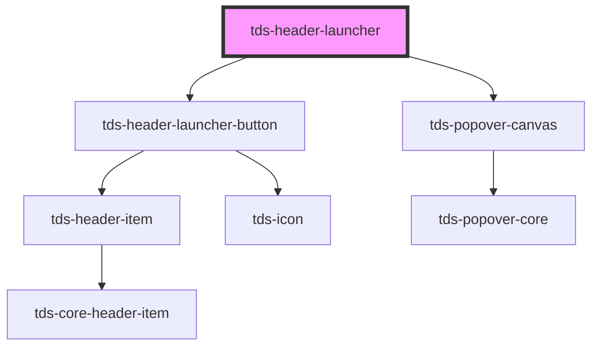

# tds-header-launcher

<!-- Auto Generated Below -->

## Slots

| Slot          | Description                                                 |
| ------------- | ----------------------------------------------------------- |
| `"<default>"` | <b>Unnamed slot.</b> For a launcher list (or grid) element. |

## Dependencies

### Depends on

- [tds-header-launcher-button](../header-launcher-button)
- [tds-popover-canvas](../../popover-canvas)

### Graph

----------------------------------------------

*Built with [StencilJS](https://stenciljs.com/)*
