# tds-icon

<!-- Auto Generated Below -->

## Properties

| Property         | Attribute         | Description                                                                                                                                     | Type                                                                                                                                                                                                                                                                                                                                                                                                                                                                                                                                                                                                                                                                                                                                                                                                                                                                                                                                                                                                                                                                                                                                                                                                                                                                                                                                                                                                                                                                                                                                                                                                                                                                                                                                                                                                                                                                                                                                                                                                                                                                                                                                                                                                                                                                                                                                                                                                                                                                                                                                                                                                                                                                                                                              | Default     |
| ---------------- | ----------------- | ----------------------------------------------------------------------------------------------------------------------------------------------- | --------------------------------------------------------------------------------------------------------------------------------------------------------------------------------------------------------------------------------------------------------------------------------------------------------------------------------------------------------------------------------------------------------------------------------------------------------------------------------------------------------------------------------------------------------------------------------------------------------------------------------------------------------------------------------------------------------------------------------------------------------------------------------------------------------------------------------------------------------------------------------------------------------------------------------------------------------------------------------------------------------------------------------------------------------------------------------------------------------------------------------------------------------------------------------------------------------------------------------------------------------------------------------------------------------------------------------------------------------------------------------------------------------------------------------------------------------------------------------------------------------------------------------------------------------------------------------------------------------------------------------------------------------------------------------------------------------------------------------------------------------------------------------------------------------------------------------------------------------------------------------------------------------------------------------------------------------------------------------------------------------------------------------------------------------------------------------------------------------------------------------------------------------------------------------------------------------------------------------------------------------------------------------------------------------------------------------------------------------------------------------------------------------------------------------------------------------------------------------------------------------------------------------------------------------------------------------------------------------------------------------------------------------------------------------------------------------------------------------- | ----------- |
| `name`           | `name`            | Pass the name of the icon. For icon names, refer to Storybook Icon controls dropdown or https://tegel.scania.com/foundations/icons/icon-library | `"acceleration-1" \| "acceleration-inactive-1" \| "arrow_diagonal" \| "arrow_disabled" \| "arrow_disabled2" \| "arrow_down" \| "arrow_left" \| "arrow_right" \| "arrow_up" \| "arrow" \| "back" \| "bento" \| "bug" \| "burger" \| "calendar_inactive" \| "calendar" \| "camera-1" \| "camera-2" \| "card" \| "cart" \| "chevron_down" \| "chevron_left" \| "chevron_right" \| "chevron_up" \| "clock_inactive" \| "clock" \| "contact_inactive" \| "contact" \| "cookie2" \| "cookie3-1" \| "cookie3" \| "cookie4" \| "cookie5" \| "cookie6" \| "cookie7" \| "cookie8" \| "cookie9" \| "coolantlevel_icon-1" \| "coolantlevel_icon-2" \| "coolantlevel_icon-3" \| "copy" \| "cross" \| "dashboard" \| "document_check" \| "document_doc" \| "document_eye" \| "document_pdf" \| "document_plus-10" \| "document_plus-11" \| "document_plus-12" \| "document_plus-13" \| "document_plus-14" \| "document_plus-15" \| "document_plus-16" \| "document_plus-8" \| "document_plus-9" \| "document_plus" \| "document_ppt" \| "document_tool" \| "document_wrong" \| "document_xls" \| "document" \| "dollar" \| "doner" \| "double_kebab" \| "download" \| "edit_inactive" \| "edit" \| "email" \| "error" \| "export_inactive" \| "export" \| "eye_inactive" \| "eye" \| "face_dissatisfied" \| "face_neutral" \| "face_satisfied" \| "factory-7" \| "factory-8" \| "factory-9" \| "factory" \| "fat_cookie" \| "ferry-1" \| "ferry-2" \| "ferry-3" \| "filters_inactive" \| "filters" \| "flash" \| "folder" \| "fuel_gauge_inactive" \| "fuel_gauge" \| "global" \| "heart_inactive" \| "heart" \| "history" \| "home_inactive" \| "home" \| "image_add" \| "image_inactive" \| "image_set" \| "image" \| "info" \| "insights" \| "kebab" \| "link_broken" \| "link" \| "lock_inactive" \| "lock" \| "meatballs" \| "message_inactive" \| "message" \| "mileage_inactive" \| "mileage" \| "minus" \| "notification_inactive" \| "notification" \| "phone_inactive" \| "phone" \| "pin_inactive" \| "pin" \| "plus" \| "print_inactive" \| "print" \| "profile_inactive" \| "profile" \| "proportions_inactive" \| "proportions" \| "redirect" \| "refresh" \| "report_inactive" \| "report" \| "save_inactive" \| "save" \| "search" \| "send_inactive" \| "send" \| "settings" \| "share" \| "skip_backwards" \| "skip_forward" \| "smartphone_inactive" \| "smartphone" \| "sorting" \| "speedometer_inactive" \| "speedometer" \| "star" \| "support" \| "tick" \| "timer" \| "tool_inactive" \| "tool" \| "trailer" \| "trash_inactive" \| "trash" \| "truck" \| "upload" \| "wallet" \| "warning" \| "weight-5" \| "weight-6" \| "weight-7" \| "weight" \| "weight2" \| "weight3" \| "weight4" \| "wifi_inactive" \| "wifi"` | `'truck'`   |
| `size`           | `size`            | Pass a size of icon as a string, for example, 32px, 1rem, 4em...                                                                                | `string`                                                                                                                                                                                                                                                                                                                                                                                                                                                                                                                                                                                                                                                                                                                                                                                                                                                                                                                                                                                                                                                                                                                                                                                                                                                                                                                                                                                                                                                                                                                                                                                                                                                                                                                                                                                                                                                                                                                                                                                                                                                                                                                                                                                                                                                                                                                                                                                                                                                                                                                                                                                                                                                                                                                          | `'16px'`    |
| `svgDescription` | `svg-description` | Set description for the svg. Also used by aria-describedby.                                                                                     | `string`                                                                                                                                                                                                                                                                                                                                                                                                                                                                                                                                                                                                                                                                                                                                                                                                                                                                                                                                                                                                                                                                                                                                                                                                                                                                                                                                                                                                                                                                                                                                                                                                                                                                                                                                                                                                                                                                                                                                                                                                                                                                                                                                                                                                                                                                                                                                                                                                                                                                                                                                                                                                                                                                                                                          | `undefined` |
| `svgTitle`       | `svg-title`       | Override the default title for the svg. Also used by aria-labelledby.                                                                           | `string`                                                                                                                                                                                                                                                                                                                                                                                                                                                                                                                                                                                                                                                                                                                                                                                                                                                                                                                                                                                                                                                                                                                                                                                                                                                                                                                                                                                                                                                                                                                                                                                                                                                                                                                                                                                                                                                                                                                                                                                                                                                                                                                                                                                                                                                                                                                                                                                                                                                                                                                                                                                                                                                                                                                          | `undefined` |

## Dependencies

### Used by

 - [tds-accordion-item](../accordion/accordion-item)
 - [tds-banner](../banner)
 - [tds-datetime](../datetime)
 - [tds-dropdown](../dropdown)
 - [tds-dropdown-option](../dropdown/dropdown-option)
 - [tds-folder-tabs](../tabs/folder-tabs)
 - [tds-footer-group](../footer/footer-group)
 - [tds-header-cell](../table/table-header-cell)
 - [tds-header-dropdown](../header/header-dropdown)
 - [tds-header-hamburger](../header/header-hamburger)
 - [tds-header-launcher-button](../header/header-launcher-button)
 - [tds-inline-tabs](../tabs/inline-tabs)
 - [tds-message](../message)
 - [tds-modal](../modal)
 - [tds-navigation-tabs](../tabs/navigation-tabs)
 - [tds-side-menu-close-button](../side-menu/side-menu-close-button)
 - [tds-side-menu-dropdown](../side-menu/side-menu-dropdown)
 - [tds-slider](../slider)
 - [tds-step](../stepper/step)
 - [tds-table-body-input-wrapper](../table/table-body-input-wrapper)
 - [tds-table-footer](../table/table-footer)
 - [tds-table-header-input-wrapper](../table/table-header-input-wrapper)
 - [tds-table-toolbar](../table/table-toolbar)
 - [tds-text-field](../text-field)
 - [tds-textarea](../textarea)
 - [tds-toast](../toast)

### Graph

```mermaid
graph TD;
  tds-accordion-item --> tds-icon
  tds-banner --> tds-icon
  tds-datetime --> tds-icon
  tds-dropdown --> tds-icon
  tds-dropdown-option --> tds-icon
  tds-folder-tabs --> tds-icon
  tds-footer-group --> tds-icon
  tds-header-cell --> tds-icon
  tds-header-dropdown --> tds-icon
  tds-header-hamburger --> tds-icon
  tds-header-launcher-button --> tds-icon
  tds-inline-tabs --> tds-icon
  tds-message --> tds-icon
  tds-modal --> tds-icon
  tds-navigation-tabs --> tds-icon
  tds-side-menu-close-button --> tds-icon
  tds-side-menu-dropdown --> tds-icon
  tds-slider --> tds-icon
  tds-step --> tds-icon
  tds-table-body-input-wrapper --> tds-icon
  tds-table-footer --> tds-icon
  tds-table-header-input-wrapper --> tds-icon
  tds-table-toolbar --> tds-icon
  tds-text-field --> tds-icon
  tds-textarea --> tds-icon
  tds-toast --> tds-icon
  style tds-icon fill:#f9f,stroke:#333,stroke-width:4px
```

----------------------------------------------

*Built with [StencilJS](https://stenciljs.com/)*
