# tds-icon

<!-- Auto Generated Below -->

## Properties

| Property         | Attribute         | Description                                                                                                                                     | Type     | Default     |
| ---------------- | ----------------- | ----------------------------------------------------------------------------------------------------------------------------------------------- | -------- | ----------- |
| `name`           | `name`            | Pass the name of the icon. For icon names, refer to Storybook Icon controls dropdown or https://tegel.scania.com/foundations/icons/icon-library | `string` | `'truck'`   |
| `size`           | `size`            | Pass a size of icon as a string, for example, 32px, 1rem, 4em...                                                                                | `string` | `'16px'`    |
| `svgDescription` | `svg-description` | Set description for the svg. Also used by aria-describedby.                                                                                     | `string` | `undefined` |
| `svgTitle`       | `svg-title`       | Override the default title for the svg. Also used by aria-labelledby.                                                                           | `string` | `undefined` |

## Dependencies

### Used by

 - [tds-accordion-item](../accordion/accordion-item)
 - [tds-banner](../banner)
 - [tds-date-picker](../date-picker)
 - [tds-date-range-picker](../date-range-picker)
 - [tds-datetime](../datetime)
 - [tds-dropdown](../dropdown)
 - [tds-dropdown-option](../dropdown/dropdown-option)
 - [tds-folder-tabs](../tabs/folder-tabs)
 - [tds-footer-group](../footer/footer-group)
 - [tds-header-dropdown](../header/header-dropdown)
 - [tds-header-hamburger](../header/header-hamburger)
 - [tds-header-launcher-button](../header/header-launcher-button)
 - [tds-inline-tabs](../tabs/inline-tabs)
 - [tds-message](../message)
 - [tds-modal](../modal)
 - [tds-navigation-tabs](../tabs/navigation-tabs)
 - [tds-side-menu-close-button](../side-menu/side-menu-close-button)
 - [tds-side-menu-dropdown](../side-menu/side-menu-dropdown)
 - [tds-slider](../slider)
 - [tds-step](../stepper/step)
 - [tds-table-footer](../table/table-footer)
 - [tds-table-toolbar](../table/table-toolbar)
 - [tds-text-field](../text-field)
 - [tds-textarea](../textarea)
 - [tds-toast](../toast)

### Graph

```mermaid
graph TD;
  tds-accordion-item --> tds-icon
  tds-banner --> tds-icon
  tds-date-picker --> tds-icon
  tds-date-range-picker --> tds-icon
  tds-datetime --> tds-icon
  tds-dropdown --> tds-icon
  tds-dropdown-option --> tds-icon
  tds-folder-tabs --> tds-icon
  tds-footer-group --> tds-icon
  tds-header-dropdown --> tds-icon
  tds-header-hamburger --> tds-icon
  tds-header-launcher-button --> tds-icon
  tds-inline-tabs --> tds-icon
  tds-message --> tds-icon
  tds-modal --> tds-icon
  tds-navigation-tabs --> tds-icon
  tds-side-menu-close-button --> tds-icon
  tds-side-menu-dropdown --> tds-icon
  tds-slider --> tds-icon
  tds-step --> tds-icon
  tds-table-footer --> tds-icon
  tds-table-toolbar --> tds-icon
  tds-text-field --> tds-icon
  tds-textarea --> tds-icon
  tds-toast --> tds-icon
  style tds-icon fill:#f9f,stroke:#333,stroke-width:4px
```

----------------------------------------------

*Built with [StencilJS](https://stenciljs.com/)*
