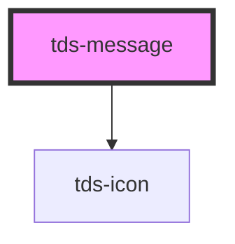

# tds-message

<!-- Auto Generated Below -->

## Properties

| Property      | Attribute      | Description                                      | Type                                                 | Default         |
| ------------- | -------------- | ------------------------------------------------ | ---------------------------------------------------- | --------------- |
| `header`      | `header`       | Header text for the component.                   | `string`                                             | `undefined`     |
| `minimal`     | `minimal`      | Minimal Message styling.                         | `boolean`                                            | `false`         |
| `modeVariant` | `mode-variant` | Variant of the component, based on current mode. | `"primary" \| "secondary"`                           | `null`          |
| `noIcon`      | `no-icon`      | Removes the icon in the Message.                 | `boolean`                                            | `false`         |
| `variant`     | `variant`      | Variant of Message.                              | `"error" \| "information" \| "success" \| "warning"` | `'information'` |

## Slots

| Slot          | Description                                                                     |
| ------------- | ------------------------------------------------------------------------------- |
| `"<default>"` | <b>Unnamed slot.</b> For the extended message. Not visible on minimal messages. |

## Dependencies

### Depends on

- [tds-icon](../icon)

### Graph

----------------------------------------------

*Built with [StencilJS](https://stenciljs.com/)*
