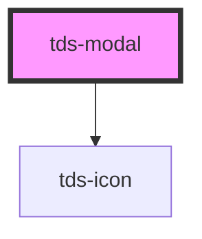

# tds-modal


### Usage with @scania/tegel-angular
If you are using the `<tds-modal>` in an Angular environment and want to use the `referenceEl` prop rather than the `selector` the referenced element can't be a Tegel component. We recommend wrapping the element in a native HTMLElement and using that as the `referenceEl`. See example below:

```html
<div #myReference>
  <tds-button text="Button"></tds-button>
</div>
<tds-modal [referenceEl]="myReference">
  
</tds-modal>

```


### Usage with @scania/tegel-react
If you are using the `<TdsModal>` in an React environment and want to
use the `referenceEl` prop rather than the `selector` the referenced element can't be a Tegel component. We recommend wrapping the element in a native HTMLElement and using that as the `referenceEl`. See example below:

```jsx
<div ref={myReference.current}>
  <TdsButton text="Button"></TdsButton>
</div>
<TdsModal referenceEl={myReference}>
  
</TdsModal>

```
<!-- Auto Generated Below -->


## Properties

| Property          | Attribute          | Description                                                                                                                                                 | Type                           | Default     |
| ----------------- | ------------------ | ----------------------------------------------------------------------------------------------------------------------------------------------------------- | ------------------------------ | ----------- |
| `actionsPosition` | `actions-position` | Changes the position behaviour of the actions slot.                                                                                                         | `"static" \| "sticky"`         | `'static'`  |
| `closable`        | `closable`         | Shows or hides the close [X] button.                                                                                                                        | `boolean`                      | `undefined` |
| `header`          | `header`           | Sets the header of the Modal.                                                                                                                               | `string`                       | `undefined` |
| `prevent`         | `prevent`          | Disables closing Modal on clicking on overlay area.                                                                                                         | `boolean`                      | `false`     |
| `referenceEl`     | --                 | Element that will show the Modal (takes priority over selector)                                                                                             | `HTMLElement`                  | `undefined` |
| `selector`        | `selector`         | CSS selector for the element that will show the Modal.                                                                                                      | `string`                       | `undefined` |
| `show`            | `show`             | Controls whether the Modal is shown or not. If this is set hiding and showing will be decided by this prop and will need to be controlled from the outside. | `boolean`                      | `undefined` |
| `size`            | `size`             | Size of Modal                                                                                                                                               | `"lg" \| "md" \| "sm" \| "xs"` | `'md'`      |


## Events

| Event      | Description                     | Type               |
| ---------- | ------------------------------- | ------------------ |
| `tdsClose` | Emits when the Modal is closed. | `CustomEvent<any>` |


## Methods

### `cleanupModal() => Promise<void>`

Cleans up event listeners and other resources.

#### Returns

Type: `Promise<void>`


### `closeModal() => Promise<void>`

Closes the Modal.

#### Returns

Type: `Promise<void>`


### `initializeModal() => Promise<void>`

Initializes or re-initializes the modal, setting up event listeners.

#### Returns

Type: `Promise<void>`


### `showModal() => Promise<void>`

Shows the Modal.

#### Returns

Type: `Promise<void>`


## Slots

| Slot        | Description                    |
| ----------- | ------------------------------ |
| `"actions"` | Slot for extra buttons         |
| `"body"`    | Slot for main content of modal |
| `"header"`  | Slot for header text           |


## Dependencies

### Depends on

- [tds-icon](../icon)

### Graph


----------------------------------------------

*Built with [StencilJS](https://stenciljs.com/)*
