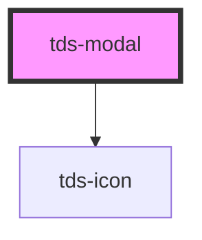

# tds-modal


### Usage with @scania/tegel-angular
If you are using the `<tds-modal>` in an Angular environment and want to use the `referenceEl` prop rather than the `selector` the referenced element can't be a Tegel component. We recommend wrapping the element in a native HTMLElement and using that as the `referenceEl`. See example below:

```html
<div #myReference>
  <tds-button text="Button"></tds-button>
</div>
<tds-modal [referenceEl]="myReference">
  
</tds-modal>

```


### Usage with @scania/tegel-react
If you are using the `<TdsModal>` in an React environment and want to
use the `referenceEl` prop rather than the `selector` the referenced element can't be a Tegel component. We recommend wrapping the element in a native HTMLElement and using that as the `referenceEl`. See example below:

```jsx
<div ref={myReference.current}>
  <TdsButton text="Button"></TdsButton>
</div>
<TdsModal referenceEl={myReference}>
  
</TdsModal>

```

## Lazy Rendered Slot Content

If you want to render the modal's content lazily (e.g. only when it is opened), `tds-modal` provides the following:

- `tdsOpen` — an event emitted just before the modal opens
- `tdsClose` — an event emitted when the modal closes
- `isOpen()` — a method that returns the current open state as a `Promise<boolean>`

These can be used to insert or remove slot content (e.g. `header`, `body`, or `actions`) on demand.
This pattern avoids rendering hidden content upfront, improves performance and gives control over when and how modal content is loaded.

### Vanilla JS Example:

```html
<tds-button id="open-modal" text="Open Modal"></tds-button>

<tds-modal header="Lazy modal" selector="#open-modal" id="lazy-modal">
  <span slot="actions">
    <tds-button data-dismiss-modal text="Close" variant="primary"></tds-button>
  </span>
</tds-modal>

    <script type="module">
      import { defineCustomElements } from "@scania/tegel/loader";
      defineCustomElements();

      const modal = document.querySelector("tds-modal");

      // Use the isOpen method to check if the modal is already open
      (async () => {
        await modal.componentOnReady();
        const isOpen = await modal.isOpen();
        if (isOpen) {
          fetchAndRenderBody();
        }
      })();

      // Add event listener for opening modal
      modal.addEventListener("tdsOpen", () => {
        console.log("Modal opened");

        // Fetch data and render it in the modal body
        fetchAndRenderBody();
      });

      // Add event listener for closing modal
      modal.addEventListener("tdsClose", () => {
        console.log("Modal closed");

        // Remove the body content when the modal is closed
        removeBodyContent();
      });

      function removeBodyContent() {
        const bodyContent = modal.querySelector('[slot="body"]');
        if (bodyContent) {
          modal.removeChild(bodyContent);
        }
      }

      async function fetchAndRenderBody() {
        // Prevent multiple fetches if already rendered
        if (modal.querySelector('[slot="body"]')) return;

        const div = document.createElement("div");
        div.slot = "body";
        div.textContent = "Loading data...";
        console.log("Loading data...");
        modal.appendChild(div);

        try {
          const res = await fetch(
            "https://jsonplaceholder.typicode.com/posts/1"
            );
            const data = await res.json();

          // Add delay to simulate loading time
          setTimeout(async () => {
            div.innerHTML = `
            <h3>${data.title}</h3>
            <p>${data.body}</p>
          `;
          }, 1000);
        } catch (error) {
          div.textContent = "Failed to load content";
          console.error("API Error:", error);
        }
      }
    </script>
```


<!-- Auto Generated Below -->


## Properties

| Property          | Attribute          | Description                                                                                                                                                 | Type                               | Default     |
| ----------------- | ------------------ | ----------------------------------------------------------------------------------------------------------------------------------------------------------- | ---------------------------------- | ----------- |
| `actionsPosition` | `actions-position` | Changes the position behaviour of the actions slot.                                                                                                         | `"static" \| "sticky"`             | `'static'`  |
| `closable`        | `closable`         | Shows or hides the close [X] button.                                                                                                                        | `boolean`                          | `true`      |
| `header`          | `header`           | Sets the header of the Modal.                                                                                                                               | `string`                           | `undefined` |
| `prevent`         | `prevent`          | Disables closing Modal on clicking on overlay area.                                                                                                         | `boolean`                          | `false`     |
| `referenceEl`     | --                 | Element that will show the Modal (takes priority over selector)                                                                                             | `HTMLElement \| null \| undefined` | `undefined` |
| `selector`        | `selector`         | CSS selector for the element that will show the Modal.                                                                                                      | `string`                           | `undefined` |
| `show`            | `show`             | Controls whether the Modal is shown or not. If this is set hiding and showing will be decided by this prop and will need to be controlled from the outside. | `boolean`                          | `undefined` |
| `size`            | `size`             | Size of Modal                                                                                                                                               | `"lg" \| "md" \| "sm" \| "xs"`     | `'md'`      |
| `tdsAlertDialog`  | `tds-alert-dialog` | Role of the modal component. Can be either 'alertdialog' for important messages that require immediate attention, or 'dialog' for regular messages.         | `"alertdialog" \| "dialog"`        | `'dialog'`  |


## Events

| Event      | Description                        | Type                |
| ---------- | ---------------------------------- | ------------------- |
| `tdsClose` | Emits when the Modal is closed.    | `CustomEvent<any>`  |
| `tdsOpen`  | Emits just before Modal is opened. | `CustomEvent<void>` |


## Methods

### `cleanupModal() => Promise<void>`

Cleans up event listeners and other resources.

#### Returns

Type: `Promise<void>`


### `closeModal() => Promise<void>`

Closes the Modal.

#### Returns

Type: `Promise<void>`


### `initializeModal() => Promise<void>`

Initializes or re-initializes the modal, setting up event listeners.

#### Returns

Type: `Promise<void>`


### `isOpen() => Promise<boolean>`

Returns the current open state of the Modal.

#### Returns

Type: `Promise<boolean>`


### `showModal() => Promise<void>`

Shows the Modal.

#### Returns

Type: `Promise<void>`


## Slots

| Slot        | Description                    |
| ----------- | ------------------------------ |
| `"actions"` | Slot for extra buttons         |
| `"body"`    | Slot for main content of modal |
| `"header"`  | Slot for header text           |


## Dependencies

### Depends on

- [tds-icon](../icon)

### Graph


----------------------------------------------

*Built with [StencilJS](https://stenciljs.com/)*
