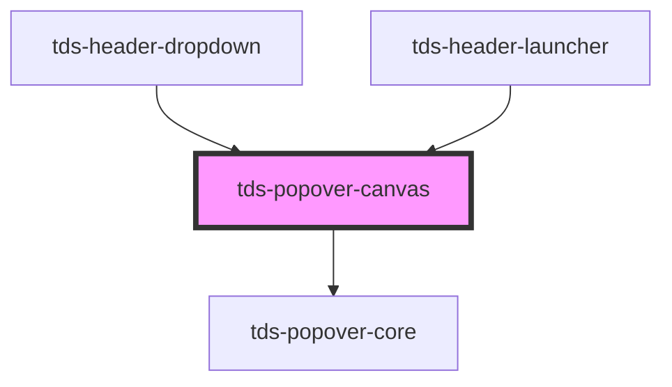

# tds-popover-canvas

### Usage with @scania/tegel-angular
If you are using the `<tds-popover-canvas>` in an Angular environment and want to
use the `referenceEl` prop rather than the `selector` the referenced element can't be a Tegel component. We recommend wrapping the element in a native HTMLElement and using that as the `referenceEl`. See example below:

```html
<div #myReference>
  <tds-button text="Button"></tds-button>
</div>
<tds-popover-canvas [referenceEl]="myReference">
  <h2 class="tds-headline-02 tds-u-mt0">A Popover Canvas!</h2>
</tds-popover-canvas>

```

### Usage with @scania/tegel-react
If you are using the `<TdsPopoverCanvas>` in an React environment and want to
use the `referenceEl` prop rather than the `selector` the referenced element can't be a Tegel component. We recommend wrapping the element in a native HTMLElement and using that as the `referenceEl`. See example below:

```jsx
<div ref={myReference.current}>
  <TdsButton text="Button"></TdsButton>
</div>
<TdsPopoverCanvas referenceEl={myReference}>
  <h2 class="tds-headline-02 tds-u-mt0">A Popover Canvas!</h2>
</TdsPopoverCanvas>

```

## Controlled vs Uncontrolled

- **Controlled**: 
  How does component enter controlled mode?
  - Leaving `selector` or `referenceEl` prop empty

  What is the behavior in controlled mode?
  - The popover will be shown or hidden only based on the `show` prop.
  - Position might be off due to lack of reference element set in `selector` or `referenceEl` prop.
  - Clicking outside the popover will not hide it.


- **Uncontrolled**: 
  How does component enter uncontrolled mode?
  - Setting the `selector` or `referenceEl` prop
  - Leaving the `show` prop `null` (default)

  What is the behavior in uncontrolled mode?
  - The popover will be shown or hidden based on mouse interactions.
  - Position is determined by `selector` or `referenceEl` prop.
  - Clicking outside the popover will hide it.

<!-- Auto Generated Below -->


## Properties

| Property         | Attribute         | Description                                                                                                                                                   | Type                                                                                                                                                                                                         | Default     |
| ---------------- | ----------------- | ------------------------------------------------------------------------------------------------------------------------------------------------------------- | ------------------------------------------------------------------------------------------------------------------------------------------------------------------------------------------------------------ | ----------- |
| `defaultOpen`    | `default-open`    | Decides if the component should be visible from the start.                                                                                                    | `boolean`                                                                                                                                                                                                    | `false`     |
| `modifiers`      | --                | Array of modifier objects to pass to popper.js. See https://popper.js.org/docs/v2/modifiers/                                                                  | `Object[]`                                                                                                                                                                                                   | `[]`        |
| `offsetDistance` | `offset-distance` | Sets the offset distance                                                                                                                                      | `number`                                                                                                                                                                                                     | `8`         |
| `offsetSkidding` | `offset-skidding` | Sets the offset skidding                                                                                                                                      | `number`                                                                                                                                                                                                     | `0`         |
| `placement`      | `placement`       | Decides the placement of the Popover Canvas. See https://popper.js.org/docs/v2/constructors/#placement                                                        | `"auto" \| "auto-end" \| "auto-start" \| "bottom" \| "bottom-end" \| "bottom-start" \| "left" \| "left-end" \| "left-start" \| "right" \| "right-end" \| "right-start" \| "top" \| "top-end" \| "top-start"` | `'auto'`    |
| `referenceEl`    | --                | Element that will trigger the Popover (takes priority over selector)                                                                                          | `HTMLElement`                                                                                                                                                                                                | `undefined` |
| `selector`       | `selector`        | The CSS-selector for an element that will trigger the Popover                                                                                                 | `string`                                                                                                                                                                                                     | `undefined` |
| `show`           | `show`            | Controls whether the Popover is shown or not. If this is set hiding and showing will be decided by this prop and will need to be controlled from the outside. | `boolean`                                                                                                                                                                                                    | `null`      |


## Methods

### `close() => Promise<void>`

Property for closing popover programmatically

#### Returns

Type: `Promise<void>`


## Slots

| Slot          | Description                                           |
| ------------- | ----------------------------------------------------- |
| `"<default>"` | <b>Unnamed slot.</b> For the contents of the popover. |


## Dependencies

### Used by

 - [tds-header-dropdown](../header/header-dropdown)
 - [tds-header-launcher](../header/header-launcher)

### Depends on

- [tds-popover-core](../popover-core)

### Graph


----------------------------------------------

*Built with [StencilJS](https://stenciljs.com/)*
