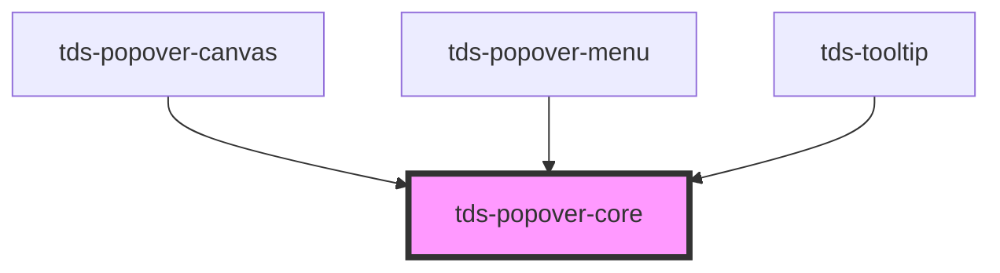

# tds-core-popover

## Controlled vs Uncontrolled

The component can be controlled or uncontrolled.

- **Controlled**: 
  How does component enter controlled mode?
  - Leaving `selector` or `referenceEl` prop empty
  - Setting the `show` prop to `true` or `false`

  What is the behavior in controlled mode?
  - The popover will be shown or hidden only based on the `show` prop.
  - Position might be off due to lack of reference element set in `selector` or `referenceEl` prop.
  - Clicking outside the popover will not hide it.

- **Uncontrolled**: 
  How does component enter uncontrolled mode?
  - Setting the `selector` or `referenceEl` prop
  - Leaving the `show` prop `null` (default)

  What is the behavior in uncontrolled mode?
  - The popover will be shown or hidden based on mouse interactions.
  - Position is determined by `selector` or `referenceEl` prop.
  - Clicking outside the popover will hide it.

<!-- Auto Generated Below -->

## Properties

| Property         | Attribute         | Description                                                                                                         | Type                                                                                                                                                                                                         | Default     |
| ---------------- | ----------------- | ------------------------------------------------------------------------------------------------------------------- | ------------------------------------------------------------------------------------------------------------------------------------------------------------------------------------------------------------ | ----------- |
| `autoHide`       | `auto-hide`       | Decides if the popover should hide automatically. Alternatevly it can be hidden externally based on emitted events. | `boolean`                                                                                                                                                                                                    | `true`      |
| `defaultOpen`    | `default-open`    | Decides if the component should be visible from the start.                                                          | `boolean`                                                                                                                                                                                                    | `false`     |
| `modifiers`      | --                | Array of modifier objects to pass to popper.js. See https://popper.js.org/docs/v2/modifiers/                        | `Object[]`                                                                                                                                                                                                   | `[]`        |
| `offsetDistance` | `offset-distance` | Sets the offset distance                                                                                            | `number`                                                                                                                                                                                                     | `8`         |
| `offsetSkidding` | `offset-skidding` | Sets the offset skidding                                                                                            | `number`                                                                                                                                                                                                     | `0`         |
| `placement`      | `placement`       | Decides the placement of the Popover Menu                                                                           | `"auto" \| "auto-end" \| "auto-start" \| "bottom" \| "bottom-end" \| "bottom-start" \| "left" \| "left-end" \| "left-start" \| "right" \| "right-end" \| "right-start" \| "top" \| "top-end" \| "top-start"` | `'auto'`    |
| `referenceEl`    | --                | Element that will trigger the pop-over (takes priority over selector)                                               | `HTMLElement`                                                                                                                                                                                                | `undefined` |
| `selector`       | `selector`        | The CSS-selector for an element that will trigger the pop-over                                                      | `string`                                                                                                                                                                                                     | `undefined` |
| `show`           | `show`            | Toggles the visibility of the component and sets component to controlled state.                                     | `boolean`                                                                                                                                                                                                    | `null`      |
| `trigger`        | `trigger`         | What triggers the popover to show                                                                                   | `"click" \| "hover" \| "hover-popover"`                                                                                                                                                                      | `'click'`   |

## Methods

### `close() => Promise<void>`

Property for closing popover programmatically

#### Returns

Type: `Promise<void>`

## Dependencies

### Used by

 - [tds-popover-canvas](../popover-canvas)
 - [tds-popover-menu](../popover-menu)
 - [tds-tooltip](../tooltip)

### Graph

----------------------------------------------

*Built with [StencilJS](https://stenciljs.com/)*
