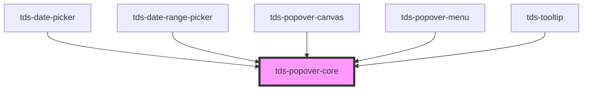

# tds-core-popover

<!-- Auto Generated Below -->

## Properties

| Property         | Attribute         | Description                                                                                                                                                                                                                                                                  | Type                                                                                                                                                                                                         | Default     |
| ---------------- | ----------------- | ---------------------------------------------------------------------------------------------------------------------------------------------------------------------------------------------------------------------------------------------------------------------------- | ------------------------------------------------------------------------------------------------------------------------------------------------------------------------------------------------------------ | ----------- |
| `autoHide`       | `auto-hide`       | Decides if the popover should hide automatically. Alternatevly it can be hidden externally based on emitted events.                                                                                                                                                          | `boolean`                                                                                                                                                                                                    | `true`      |
| `defaultShow`    | `default-show`    | Decides if the component should be visible from the start.                                                                                                                                                                                                                   | `boolean`                                                                                                                                                                                                    | `false`     |
| `modifiers`      | --                | Array of modifier objects to pass to popper.js. See https://popper.js.org/docs/v2/modifiers/                                                                                                                                                                                 | `Object[]`                                                                                                                                                                                                   | `[]`        |
| `offsetDistance` | `offset-distance` | Sets the offset distance                                                                                                                                                                                                                                                     | `number`                                                                                                                                                                                                     | `8`         |
| `offsetSkidding` | `offset-skidding` | Sets the offset skidding                                                                                                                                                                                                                                                     | `number`                                                                                                                                                                                                     | `0`         |
| `placement`      | `placement`       | Decides the placement of the Popover Menu                                                                                                                                                                                                                                    | `"auto" \| "auto-end" \| "auto-start" \| "bottom" \| "bottom-end" \| "bottom-start" \| "left" \| "left-end" \| "left-start" \| "right" \| "right-end" \| "right-start" \| "top" \| "top-end" \| "top-start"` | `'auto'`    |
| `referenceEl`    | --                | Element that will trigger the pop-over (takes priority over selector)                                                                                                                                                                                                        | `HTMLElement`                                                                                                                                                                                                | `undefined` |
| `selector`       | `selector`        | The CSS-selector for an element that will trigger the pop-over                                                                                                                                                                                                               | `string`                                                                                                                                                                                                     | `undefined` |
| `show`           | `show`            | Controls whether the Popover is shown or not. If this is set hiding and showing will be decided by this prop and will need to be controlled from the outside. This also means that clicking outside of the popover won't close it. Takes precedence over `defaultShow` prop. | `boolean`                                                                                                                                                                                                    | `null`      |
| `trigger`        | `trigger`         | What triggers the popover to show                                                                                                                                                                                                                                            | `"click" \| "hover" \| "hover-popover"`                                                                                                                                                                      | `'click'`   |

## Methods

### `close() => Promise<void>`

Property for closing popover programmatically

#### Returns

Type: `Promise<void>`

## Dependencies

### Used by

 - [tds-date-picker](../_beta/date-picker/date-picker-single)
 - [tds-date-range-picker](../_beta/date-picker/date-range-picker)
 - [tds-popover-canvas](../popover-canvas)
 - [tds-popover-menu](../popover-menu)
 - [tds-tooltip](../tooltip)

### Graph

----------------------------------------------

*Built with [StencilJS](https://stenciljs.com/)*
