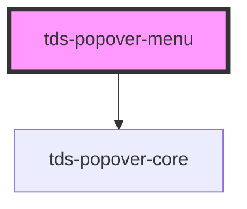

# tds-popover-menu


### Usage with @scania/tegel-angular
If you are using the `<tds-popover-menu>` in an Angular environment and want to
use the `referenceEl` prop rather than the `selector` the referenced element can't be a Tegel component. We recommend wrapping the element in a native HTMLElement and using that as the `referenceEl`. See example below:

```html
<div #myReference>
  <tds-button text="Button"></tds-button>
</div>
<tds-popover-menu [referenceEl]="myReference">
  <tds-popover-menu-item>
    <a href="#">Action</a>
  </tds-popover-menu-item>
</tds-popover-menu>

```

### Usage with @scania/tegel-react
If you are using the `<TdsPopoverMenu>` in an React environment and want to
use the `referenceEl` prop rather than the `selector` the referenced element can't be a Tegel component. We recommend wrapping the element in a native HTMLElement and using that as the `referenceEl`. See example below:

```jsx
<div ref={myReference.current}>
  <TdsButton text="Button"></TdsButton>
</div>
<TdsPopoverMenu referenceEl={myReference}>
  <TdsPopoverMenuItem>
    <a href="#">Action</a>
  </TdsPopoverMenuItem>
</TdsPopoverMenu>

```
<br>
### Controlled vs Uncontrolled

#### Uncontrolled mode
The popover component will be shown or hidden based on a `trigger` prop and `selector` or `referenceEl` prop.

Example:

```html
<button id="trigger">Open Popover</button>
<tds-popover-menu [selector]="#trigger">
  <tds-popover-menu-item>
    <a href="#">Action</a>
  </tds-popover-menu-item>
</tds-popover-menu>
```

#### Controlled mode
The `show` prop can be used to control the visibility of the popover, meaning that the popover will be shown or hidden based on the `show` prop. Props `selector` or `referenceEl` are still needed in order to determine the position of the popover. 

Example:

```html
<button id="trigger" onClick="{() => showPopover = !showPopover}">Open Popover</button>
<tds-popover-menu id="popover" selector="#trigger" show="showPopover">
  <tds-popover-menu-item>
    <a href="#">Action</a>
  </tds-popover-menu-item>
</tds-popover-menu>

```

<!-- Auto Generated Below -->


## Properties

| Property         | Attribute         | Description                                                                                                                                                                                                                                                                  | Type                                                                                                                                                                                                         | Default     |
| ---------------- | ----------------- | ---------------------------------------------------------------------------------------------------------------------------------------------------------------------------------------------------------------------------------------------------------------------------- | ------------------------------------------------------------------------------------------------------------------------------------------------------------------------------------------------------------ | ----------- |
| `animation`      | `animation`       | Whether the popover should animate when being opened/closed or not                                                                                                                                                                                                           | `string`                                                                                                                                                                                                     | `'none'`    |
| `defaultShow`    | `default-show`    | Decides if the component should be visible from the start.                                                                                                                                                                                                                   | `boolean`                                                                                                                                                                                                    | `false`     |
| `fluidWidth`     | `fluid-width`     | If true this unsets the width (160px) of the Popover Menu                                                                                                                                                                                                                    | `boolean`                                                                                                                                                                                                    | `false`     |
| `offsetDistance` | `offset-distance` | Sets the offset distance                                                                                                                                                                                                                                                     | `number`                                                                                                                                                                                                     | `8`         |
| `offsetSkidding` | `offset-skidding` | Sets the offset skidding                                                                                                                                                                                                                                                     | `number`                                                                                                                                                                                                     | `0`         |
| `placement`      | `placement`       | Decides the placement of the Popover Menu                                                                                                                                                                                                                                    | `"auto" \| "auto-end" \| "auto-start" \| "bottom" \| "bottom-end" \| "bottom-start" \| "left" \| "left-end" \| "left-start" \| "right" \| "right-end" \| "right-start" \| "top" \| "top-end" \| "top-start"` | `'auto'`    |
| `referenceEl`    | --                | Element that will trigger the pop-over (takes priority over selector)                                                                                                                                                                                                        | `HTMLElement`                                                                                                                                                                                                | `undefined` |
| `selector`       | `selector`        | The CSS-selector for an element that will trigger the pop-over                                                                                                                                                                                                               | `string`                                                                                                                                                                                                     | `undefined` |
| `show`           | `show`            | Controls whether the Popover is shown or not. If this is set hiding and showing will be decided by this prop and will need to be controlled from the outside. This also means that clicking outside of the popover won't close it. Takes precedence over `defaultShow` prop. | `boolean`                                                                                                                                                                                                    | `null`      |


## Methods

### `close() => Promise<void>`

Property for closing popover programmatically

#### Returns

Type: `Promise<void>`


## Slots

| Slot          | Description                                      |
| ------------- | ------------------------------------------------ |
| `"<default>"` | <b>Unnamed slot.</b> For the list of menu items. |


## Dependencies

### Depends on

- [tds-popover-core](../popover-core)

### Graph


----------------------------------------------

*Built with [StencilJS](https://stenciljs.com/)*
