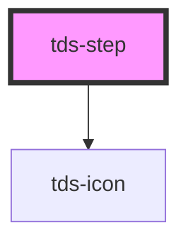

# tds-stepper-item

<!-- Auto Generated Below -->

## Properties

| Property | Attribute | Description                                                                        | Type                                              | Default      |
| -------- | --------- | ---------------------------------------------------------------------------------- | ------------------------------------------------- | ------------ |
| `index`  | `index`   | Index of the step. Will be displayed in the step if the state is current/upcoming. | `string`                                          | `undefined`  |
| `state`  | `state`   | State of the Step                                                                  | `"current" \| "error" \| "success" \| "upcoming"` | `'upcoming'` |

## Slots

| Slot      | Description              |
| --------- | ------------------------ |
| `"label"` | Slot for the label text. |

## Dependencies

### Depends on

- [tds-icon](../../icon)

### Graph

----------------------------------------------

*Built with [StencilJS](https://stenciljs.com/)*
