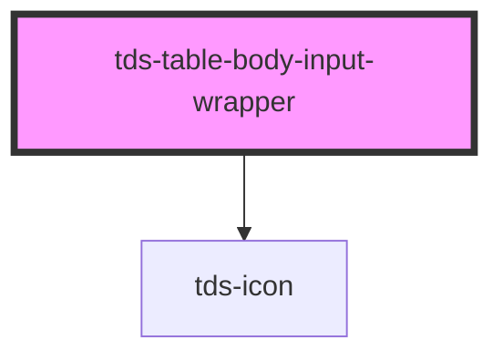

# tds-table-input-wrapper

<!-- Auto Generated Below -->

## Properties

| Property   | Attribute   | Description                        | Type      | Default |
| ---------- | ----------- | ---------------------------------- | --------- | ------- |
| `showIcon` | `show-icon` | Controls if the edit icon is shown | `boolean` | `true`  |

## Dependencies

### Depends on

- [tds-icon](../../icon)

### Graph

----------------------------------------------

*Built with [StencilJS](https://stenciljs.com/)*
