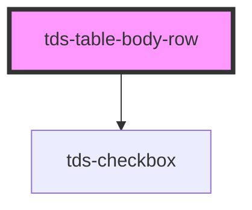

# tds-table-body-row

<!-- Auto Generated Below -->

## Properties

| Property    | Attribute   | Description                                                      | Type      | Default |
| ----------- | ----------- | ---------------------------------------------------------------- | --------- | ------- |
| `clickable` | `clickable` | Makes the row clickable and tabbable for accessibility purposes. | `boolean` | `false` |
| `disabled`  | `disabled`  | Marks the row as disabled, used for multiselect table.           | `boolean` | `false` |
| `selected`  | `selected`  | Marks the row as selected, used for multiselect table.           | `boolean` | `false` |

## Events

| Event       | Description                                      | Type                                                                       |
| ----------- | ------------------------------------------------ | -------------------------------------------------------------------------- |
| `tdsClick`  | Event emitted when a row is clicked.             | `CustomEvent<{ tableId: string; rowIndex: number; }>`                      |
| `tdsSelect` | Event emitted when a row is selected/deselected. | `CustomEvent<{ tableId: string; checked: boolean; selectedRows: any[]; }>` |

## Slots

| Slot          | Description                         |
| ------------- | ----------------------------------- |
| `"<default>"` | <b>Unnamed slot.</b> For the cells. |

## Dependencies

### Depends on

- [tds-checkbox](../../checkbox)

### Graph

----------------------------------------------

*Built with [StencilJS](https://stenciljs.com/)*
