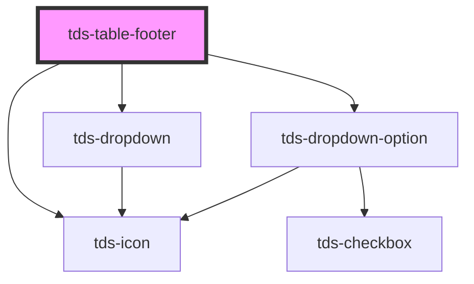

# tds-table-footer

<!-- Auto Generated Below -->

## Properties

| Property            | Attribute          | Description                                                                                                                | Type       | Default        |
| ------------------- | ------------------ | -------------------------------------------------------------------------------------------------------------------------- | ---------- | -------------- |
| `cols`              | `cols`             | <b>Client override</b> Used to set the column span of the footer. Use as fallback if the automatic count of columns fails. | `number`   | `null`         |
| `pages`             | `pages`            | Sets the number of pages.                                                                                                  | `number`   | `null`         |
| `pagination`        | `pagination`       | Enable pagination and show pagination controls                                                                             | `boolean`  | `false`        |
| `paginationValue`   | `pagination-value` | Sets the pagination number.                                                                                                | `number`   | `1`            |
| `rowsPerPageValues` | --                 |                                                                                                                            | `number[]` | `[10, 25, 50]` |
| `rowsperpage`       | `rowsperpage`      |                                                                                                                            | `boolean`  | `true`         |

## Events

| Event           | Description                                                                                                                          | Type                                                                               |
| --------------- | ------------------------------------------------------------------------------------------------------------------------------------ | ---------------------------------------------------------------------------------- |
| `tdsPagination` | Event to send current page value to tds-table-body component, can also be listened to in order to implement custom pagination logic. | `CustomEvent<{ tableId: string; paginationValue: number; rowsPerPage?: number; }>` |

## Dependencies

### Depends on

- [tds-dropdown](../../dropdown)
- [tds-dropdown-option](../../dropdown/dropdown-option)
- [tds-icon](../../icon)

### Graph

----------------------------------------------

*Built with [StencilJS](https://stenciljs.com/)*
