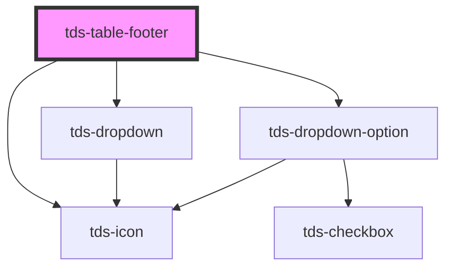

# tds-table-footer

<!-- Auto Generated Below -->

## Properties

| Property                           | Attribute                               | Description                                                                                                                                                                                                                                | Type                       | Default                  |
| ---------------------------------- | --------------------------------------- | ------------------------------------------------------------------------------------------------------------------------------------------------------------------------------------------------------------------------------------------ | -------------------------- | ------------------------ |
| `cols`                             | `cols`                                  | <b>Client override</b> Used to set the column span of the footer. Use as fallback if the automatic count of columns fails.                                                                                                                 | `null \| number`           | `null`                   |
| `pages`                            | `pages`                                 | Sets the number of pages.   If pagination is enabled, this value must be defined and controlled by the consumer of Tegel.                                                                                                              | `number`                   | `0`                      |
| `pagination`                       | `pagination`                            | Enable pagination and show pagination controls                                                                                                                                                                                             | `boolean`                  | `false`                  |
| `paginationLabel`                  | `pagination-label`                      | Set pagination label. Use {pages} as placeholder for the total number of pages.                                                                                                                                                            | `string`                   | `'of {pages} pages'`     |
| `paginationValue`                  | `pagination-value`                      | Sets the pagination number.                                                                                                                                                                                                                | `number`                   | `1`                      |
| `rowsPerPageDropdownAriaLabel`     | `rows-per-page-dropdown-aria-label`     | Set rows per page dropdown aria label.                                                                                                                                                                                                     | `string`                   | `'Select rows per page'` |
| `rowsPerPageDropdownOpenDirection` | `rows-per-page-dropdown-open-direction` | Set rows per page dropdown open direction                                                                                                                                                                                                  | `"auto" \| "down" \| "up"` | `'auto'`                 |
| `rowsPerPageLabel`                 | `rows-per-page-label`                   | Set rows per page label.                                                                                                                                                                                                                   | `string`                   | `'Rows per page'`        |
| `rowsPerPageValue`                 | `rows-per-page-value`                   | Sets the number of rows that should appear per page.   If pagination is enabled, this value must be defined and controlled by the consumer of Tegel.   Otherwise, it will default to the first element of the "rowsPerPageValues". | `number \| undefined`      | `undefined`              |
| `rowsPerPageValues`                | --                                      | Set available rows per page values.   If pagination is enabled, this array must be defined and controlled by the consumer of Tegel                                                                                                     | `number[]`                 | `[10, 25, 50]`           |
| `rowsperpage`                      | `rowsperpage`                           | Enable rows per page dropdown                                                                                                                                                                                                              | `boolean`                  | `true`                   |

## Events

| Event           | Description                                                                                                                          | Type                                                                                                         |
| --------------- | ------------------------------------------------------------------------------------------------------------------------------------ | ------------------------------------------------------------------------------------------------------------ |
| `tdsPagination` | Event to send current page value to tds-table-body component, can also be listened to in order to implement custom pagination logic. | `CustomEvent<{ tableId: string \| undefined; paginationValue: number; rowsPerPage?: number \| undefined; }>` |

## Dependencies

### Depends on

- [tds-dropdown](../../dropdown)
- [tds-dropdown-option](../../dropdown/dropdown-option)
- [tds-icon](../../icon)

### Graph

```mermaid
graph TD;
  tds-table-footer --> tds-dropdown
  tds-table-footer --> tds-dropdown-option
  tds-table-footer --> tds-icon
  tds-dropdown --> tds-icon
  tds-dropdown-option --> tds-checkbox
  tds-dropdown-option --> tds-icon
  style tds-table-footer fill:#f9f,stroke:#333,stroke-width:4px
```

----------------------------------------------

*Built with [StencilJS](https://stenciljs.com/)*
