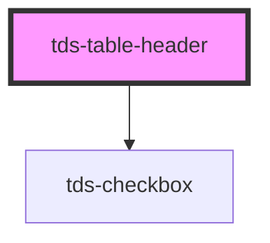

# tds-table-header-row

<!-- Auto Generated Below -->

## Properties

| Property           | Attribute           | Description                                                                     | Type      | Default |
| ------------------ | ------------------- | ------------------------------------------------------------------------------- | --------- | ------- |
| `allIndeterminate` | `all-indeterminate` | Prop for controling the interdeminate state of the "all selected"-checkbox      | `boolean` | `false` |
| `allSelected`      | `all-selected`      | Prop for controling the checked/unchecked state of the "all selected"-checkbox. | `boolean` | `false` |

## Events

| Event          | Description                                                       | Type                                                                       |
| -------------- | ----------------------------------------------------------------- | -------------------------------------------------------------------------- |
| `tdsSelectAll` | Event emitted when the status of the select all checkbox changes. | `CustomEvent<{ tableId: string; checked: boolean; selectedRows: any[]; }>` |

## Slots

| Slot          | Description                                |
| ------------- | ------------------------------------------ |
| `"<default>"` | <b>Unnamed slot.</b> For the header cells. |

## Dependencies

### Depends on

- [tds-checkbox](../../checkbox)

### Graph

----------------------------------------------

*Built with [StencilJS](https://stenciljs.com/)*
