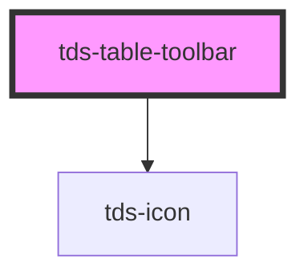

# tds-table-toolbar

<!-- Auto Generated Below -->

## Properties

| Property     | Attribute     | Description                  | Type      | Default |
| ------------ | ------------- | ---------------------------- | --------- | ------- |
| `filter`     | `filter`      | Enables preview of searchbar | `boolean` | `false` |
| `tableTitle` | `table-title` | Adds title to the Table      | `string`  | `''`    |

## Events

| Event       | Description                                                                                                                                   | Type                                               |
| ----------- | --------------------------------------------------------------------------------------------------------------------------------------------- | -------------------------------------------------- |
| `tdsFilter` | Used for sending users' input to the main parent tds-table the component, can also be listened to in order to implement custom sorting logic. | `CustomEvent<{ tableId: string; query: string; }>` |

## Slots

| Slot    | Description                                         |
| ------- | --------------------------------------------------- |
| `"end"` | Slot for the end (right side) of the Table Toolbar. |

## Dependencies

### Depends on

- [tds-icon](../../icon)

### Graph

----------------------------------------------

*Built with [StencilJS](https://stenciljs.com/)*
