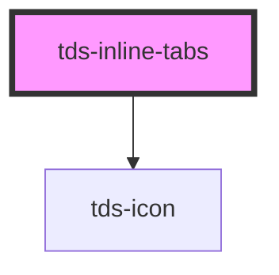

# tds-inline-tabs

## Usage with Dynamically Loaded Children

The `tds-inline-tabs` component supports an `autoInit` property. This is useful when tab children are rendered asynchronously (e.g., after a fetch or DOM update). If `autoInit` is set to `false`, you must manually call the `reinitialize()` method when children are present.

**Vanilla JS Example:**

```html
<tds-inline-tabs autoInit="false" id="myTabs">
  <!-- Children will be added dynamically -->
</tds-inline-tabs>
```

```js
// Dynamically add children
document.getElementById('myTabs').innerHTML = `
  <tds-inline-tab>Tab 1</tds-inline-tab>
  <tds-inline-tab>Tab 2</tds-inline-tab>
`;
// Manually initialize when children are present
setTimeout(() => {
  document.getElementById('myTabs').reinitialize();
}, 0);
```

If you do not call `reinitialize()` and `autoInit` is `false`, the tabs will not function as expected. If `autoInit` is `true` (default), the component will attempt to initialize automatically, but if children are not present at first render, a warning will be logged and you can still call `reinitialize()` later.


<!-- Auto Generated Below -->


## Properties

| Property                  | Attribute                     | Description                                                                                                              | Type                       | Default          |
| ------------------------- | ----------------------------- | ------------------------------------------------------------------------------------------------------------------------ | -------------------------- | ---------------- |
| `autoInit`                | `auto-init`                   | If true, the component will automatically initialize the tabs, otherwise the user needs to call the reinitialize method. | `boolean`                  | `true`           |
| `defaultSelectedIndex`    | `default-selected-index`      | Sets the default selected Tab.                                                                                           | `number`                   | `0`              |
| `leftPadding`             | `left-padding`                | Custom left padding value for the wrapper element.                                                                       | `number`                   | `32`             |
| `modeVariant`             | `mode-variant`                | Variant of the Tabs, primary= on white, secondary= on grey50                                                             | `"primary" \| "secondary"` | `'primary'`      |
| `selectedIndex`           | `selected-index`              | Sets the selected Tab. If this is set, all Tab changes need to be handled by the user.                                   | `number`                   | `undefined`      |
| `tdsScrollLeftAriaLabel`  | `tds-scroll-left-aria-label`  | Defines aria-label on left scroll button                                                                                 | `string`                   | `'Scroll left'`  |
| `tdsScrollRightAriaLabel` | `tds-scroll-right-aria-label` | Defines aria-label on right scroll button                                                                                | `string`                   | `'Scroll right'` |


## Events

| Event       | Description                                     | Type                                         |
| ----------- | ----------------------------------------------- | -------------------------------------------- |
| `tdsChange` | Event emitted when the selected Tab is changed. | `CustomEvent<{ selectedTabIndex: number; }>` |


## Methods

### `reinitialize() => Promise<void>`

Reinitializes the component.

#### Returns

Type: `Promise<void>`


### `selectTab(tabIndex: number) => Promise<{ selectedTabIndex: number; }>`

Selects a Tab based on tabindex, will not select a disabled Tab.

#### Parameters

| Name       | Type     | Description |
| ---------- | -------- | ----------- |
| `tabIndex` | `number` |             |

#### Returns

Type: `Promise<{ selectedTabIndex: number; }>`


## Slots

| Slot          | Description                                |
| ------------- | ------------------------------------------ |
| `"<default>"` | <b>Unnamed slot.</b> For the tab elements. |


## Dependencies

### Depends on

- [tds-icon](../../icon)

### Graph


----------------------------------------------

*Built with [StencilJS](https://stenciljs.com/)*
