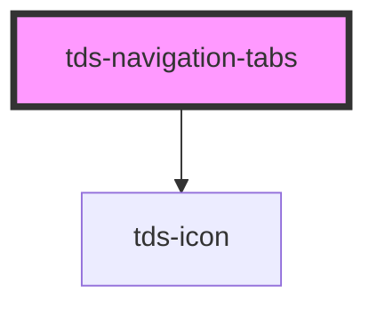

# tds-navigation-tabs

🚧 This component is not yet accessible. Please refer to the [Accessibility Guidelines](https://tds-storybook.tegel.scania.com/?path=/docs/foundations-accessibility--docs) for more information.

<!-- Auto Generated Below -->

## Properties

| Property                  | Attribute                     | Description                                                                            | Type                       | Default          |
| ------------------------- | ----------------------------- | -------------------------------------------------------------------------------------- | -------------------------- | ---------------- |
| `defaultSelectedIndex`    | `default-selected-index`      | Sets the default selected Tab.                                                         | `number`                   | `0`              |
| `leftPadding`             | `left-padding`                | Custom left padding value for the wrapper element.                                     | `number`                   | `32`             |
| `modeVariant`             | `mode-variant`                | Variant of the Tabs, primary= on white, secondary= on grey50                           | `"primary" \| "secondary"` | `'primary'`      |
| `selectedIndex`           | `selected-index`              | Sets the selected Tab. If this is set, all Tab changes need to be handled by the user. | `number \| undefined`      | `undefined`      |
| `tdsScrollLeftAriaLabel`  | `tds-scroll-left-aria-label`  | Defines aria-label on left scroll button                                               | `string`                   | `'Scroll left'`  |
| `tdsScrollRightAriaLabel` | `tds-scroll-right-aria-label` | Defines aria-label on right scroll button                                              | `string`                   | `'Scroll right'` |

## Events

| Event       | Description                                     | Type                                         |
| ----------- | ----------------------------------------------- | -------------------------------------------- |
| `tdsChange` | Event emitted when the selected Tab is changed. | `CustomEvent<{ selectedTabIndex: number; }>` |

## Methods

### `reinitialize() => Promise<void>`

Reinitializes the component.

#### Returns

Type: `Promise<void>`

### `selectTab(tabIndex: number) => Promise<{ selectedTabIndex: number | undefined; }>`

Sets the passed tabindex as the selected Tab.

#### Parameters

| Name       | Type     | Description |
| ---------- | -------- | ----------- |
| `tabIndex` | `number` |             |

#### Returns

Type: `Promise<{ selectedTabIndex: number | undefined; }>`

## Slots

| Slot          | Description                                |
| ------------- | ------------------------------------------ |
| `"<default>"` | <b>Unnamed slot.</b> For the tab elements. |

## Dependencies

### Depends on

- [tds-icon](../../icon)

### Graph

----------------------------------------------

*Built with [StencilJS](https://stenciljs.com/)*
