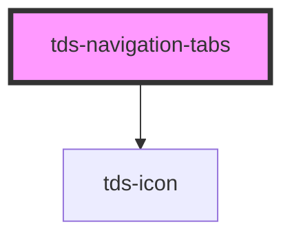

# tds-navigation-tabs

<!-- Auto Generated Below -->

## Properties

| Property               | Attribute                | Description                                                                            | Type                       | Default     |
| ---------------------- | ------------------------ | -------------------------------------------------------------------------------------- | -------------------------- | ----------- |
| `defaultSelectedIndex` | `default-selected-index` | Sets the default selected Tab.                                                         | `number`                   | `0`         |
| `modeVariant`          | `mode-variant`           | Variant of the Tabs, primary= on white, secondary= on grey50                           | `"primary" \| "secondary"` | `'primary'` |
| `padding`              | `padding`                | Custom padding value for tab items. If false, no custom padding is applied.            | `boolean \| number`        | `false`     |
| `selectedIndex`        | `selected-index`         | Sets the selected Tab. If this is set, all Tab changes need to be handled by the user. | `number`                   | `undefined` |

## Events

| Event       | Description                                     | Type                                         |
| ----------- | ----------------------------------------------- | -------------------------------------------- |
| `tdsChange` | Event emitted when the selected Tab is changed. | `CustomEvent<{ selectedTabIndex: number; }>` |

## Methods

### `reinitialize() => Promise<void>`

Reinitializes the component.

#### Returns

Type: `Promise<void>`

### `selectTab(tabIndex: number) => Promise<{ selectedTabIndex: number; }>`

Sets the passed tabindex as the selected Tab.

#### Parameters

| Name       | Type     | Description |
| ---------- | -------- | ----------- |
| `tabIndex` | `number` |             |

#### Returns

Type: `Promise<{ selectedTabIndex: number; }>`

## Slots

| Slot          | Description                                |
| ------------- | ------------------------------------------ |
| `"<default>"` | <b>Unnamed slot.</b> For the tab elements. |

## Dependencies

### Depends on

- [tds-icon](../../icon)

### Graph

----------------------------------------------

*Built with [StencilJS](https://stenciljs.com/)*
