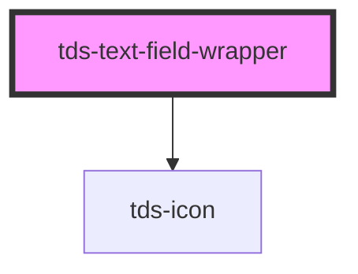

# tds-text-field-wrapper

<!-- Auto Generated Below -->

## Properties

| Property        | Attribute        | Description                                 | Type                                  | Default      |
| --------------- | ---------------- | ------------------------------------------- | ------------------------------------- | ------------ |
| `helper`        | `helper`         | Helper text                                 | `string`                              | `undefined`  |
| `label`         | `label`          | Label text                                  | `string`                              | `''`         |
| `labelPosition` | `label-position` | Position of the label for the Text Field.   | `"inside" \| "no-label" \| "outside"` | `'no-label'` |
| `maxLength`     | `max-length`     | Max length of input                         | `number`                              | `undefined`  |
| `modeVariant`   | `mode-variant`   | Mode variant of the Text Field              | `"primary" \| "secondary"`            | `null`       |
| `name`          | `name`           | Name property                               | `string`                              | `''`         |
| `noMinWidth`    | `no-min-width`   | Unset minimum width of 208px.               | `boolean`                             | `false`      |
| `size`          | `size`           | Size of the input                           | `"lg" \| "md" \| "sm"`                | `'lg'`       |
| `state`         | `state`          | Error state of input                        | `"default" \| "error" \| "success"`   | `'default'`  |
| `type`          | `type`           | Which input type, text, password or similar | `"number" \| "password" \| "text"`    | `'text'`     |

## Slots

| Slot       | Description                                                                                 |
| ---------- | ------------------------------------------------------------------------------------------- |
| `"prefix"` | Slot for the prefix in the component.                                                       |
| `"suffix"` | Slot for the suffix in the component. Suffix is hidden when the input is in readonly state. |

## Dependencies

### Depends on

- [tds-icon](../icon)

### Graph

----------------------------------------------

*Built with [StencilJS](https://stenciljs.com/)*
