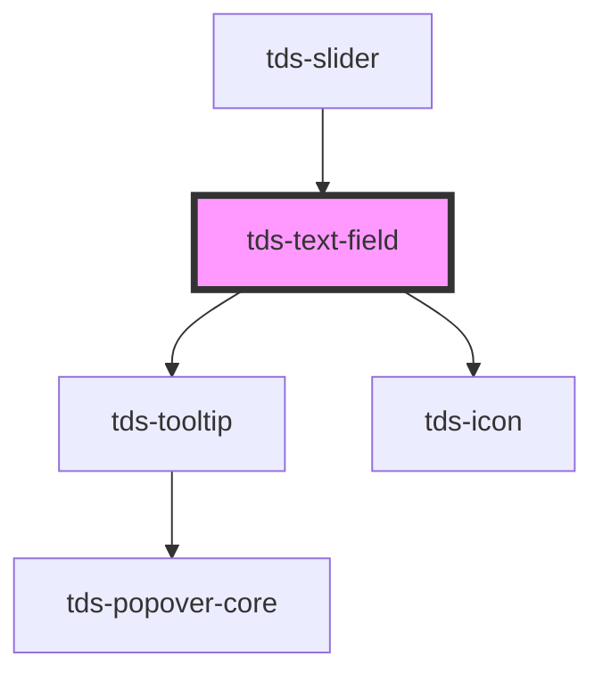

# tds-text-field

<!-- Auto Generated Below -->

## Properties

| Property           | Attribute             | Description                                                                                                  | Type                                                   | Default      |
| ------------------ | --------------------- | ------------------------------------------------------------------------------------------------------------ | ------------------------------------------------------ | ------------ |
| `autocomplete`     | `autocomplete`        | Value to be used for the text field's autocomplete attribute                                                 | `string`                                               | `'off'`      |
| `autofocus`        | `autofocus`           | Autofocus for input                                                                                          | `boolean`                                              | `false`      |
| `disabled`         | `disabled`            | Set input in disabled state                                                                                  | `boolean`                                              | `false`      |
| `helper`           | `helper`              | Helper text                                                                                                  | `string`                                               | `undefined`  |
| `hideNumberArrows` | `hide-number-arrows`  | Hides the native arrows on number input type                                                                 | `boolean`                                              | `false`      |
| `hideReadOnlyIcon` | `hide-read-only-icon` | Hides the read-only icon in the Text Field. Requires Read Only to be enabled.                                | `boolean`                                              | `false`      |
| `label`            | `label`               | Label text                                                                                                   | `string`                                               | `''`         |
| `labelPosition`    | `label-position`      | Position of the label for the Text Field.                                                                    | `"inside" \| "no-label" \| "outside"`                  | `'no-label'` |
| `max`              | `max`                 | Max allowed value for input type number                                                                      | `number \| string`                                     | `undefined`  |
| `maxLength`        | `max-length`          | Max length of input                                                                                          | `number`                                               | `undefined`  |
| `min`              | `min`                 | Min allowed value for input type number                                                                      | `number \| string`                                     | `undefined`  |
| `modeVariant`      | `mode-variant`        | Mode variant of the Text Field                                                                               | `"primary" \| "secondary"`                             | `null`       |
| `name`             | `name`                | Name property                                                                                                | `string`                                               | `''`         |
| `noMinWidth`       | `no-min-width`        | Unset minimum width of 208px.                                                                                | `boolean`                                              | `false`      |
| `placeholder`      | `placeholder`         | Placeholder text                                                                                             | `string`                                               | `''`         |
| `readOnly`         | `read-only`           | Set input in readonly state                                                                                  | `boolean`                                              | `false`      |
| `required`         | `required`            | Makes the text field required                                                                                | `boolean`                                              | `false`      |
| `size`             | `size`                | Size of the input                                                                                            | `"lg" \| "md" \| "sm"`                                 | `'lg'`       |
| `state`            | `state`               | Error state of input                                                                                         | `"default" \| "error" \| "success"`                    | `'default'`  |
| `step`             | `step`                | Step value for input type number                                                                             | `number \| string`                                     | `undefined`  |
| `tdsAriaLabel`     | `tds-aria-label`      | Value to be used for the aria-label attribute. Can be used for announcing that readOnly prop is set to true. | `string`                                               | `undefined`  |
| `type`             | `type`                | Which input type, text, password or similar                                                                  | `"email" \| "number" \| "password" \| "tel" \| "text"` | `'text'`     |
| `value`            | `value`               | Value of the input text                                                                                      | `string`                                               | `''`         |

## Events

| Event       | Description                                                               | Type                                                                                    |
| ----------- | ------------------------------------------------------------------------- | --------------------------------------------------------------------------------------- |
| `tdsBlur`   | Blur event for the Text Field                                             | `CustomEvent<FocusEvent>`                                                               |
| `tdsChange` | Change event for the Text Field                                           | `CustomEvent<any>`                                                                      |
| `tdsError`  | Error event for the Text Field - emitted when value is clamped to min/max | `CustomEvent<{ originalValue: string; clampedValue: string; reason: "max" \| "min"; }>` |
| `tdsFocus`  | Focus event for the Text Field                                            | `CustomEvent<FocusEvent>`                                                               |
| `tdsInput`  | Input event for the Text Field                                            | `CustomEvent<InputEvent>`                                                               |

## Methods

### `focusElement() => Promise<void>`

Method to handle focus

#### Returns

Type: `Promise<void>`

## Slots

| Slot       | Description                                                                                 |
| ---------- | ------------------------------------------------------------------------------------------- |
| `"prefix"` | Slot for the prefix in the component.                                                       |
| `"suffix"` | Slot for the suffix in the component. Suffix is hidden when the input is in readonly state. |

## Dependencies

### Used by

 - [tds-slider](../slider)

### Depends on

- [tds-tooltip](../tooltip)
- [tds-icon](../icon)

### Graph

----------------------------------------------

*Built with [StencilJS](https://stenciljs.com/)*
