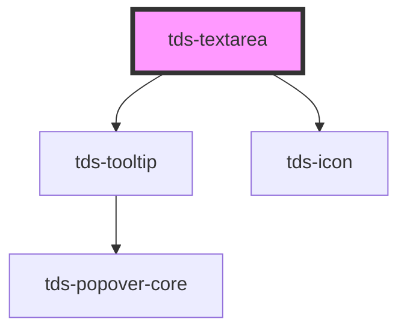

# tds-textarea

<!-- Auto Generated Below -->

## Properties

| Property           | Attribute             | Description                                                                                                  | Type                                  | Default      |
| ------------------ | --------------------- | ------------------------------------------------------------------------------------------------------------ | ------------------------------------- | ------------ |
| `autofocus`        | `autofocus`           | Control of autofocus                                                                                         | `boolean`                             | `false`      |
| `cols`             | `cols`                | Textarea cols attribute                                                                                      | `number`                              | `undefined`  |
| `disabled`         | `disabled`            | Set input in disabled state                                                                                  | `boolean`                             | `false`      |
| `helper`           | `helper`              | Helper text                                                                                                  | `string`                              | `undefined`  |
| `hideReadOnlyIcon` | `hide-read-only-icon` | Hide the readonly icon                                                                                       | `boolean`                             | `false`      |
| `label`            | `label`               | Label text                                                                                                   | `string`                              | `''`         |
| `labelPosition`    | `label-position`      | Position of the label for the Textarea.                                                                      | `"inside" \| "no-label" \| "outside"` | `'no-label'` |
| `maxLength`        | `max-length`          | Max length of input                                                                                          | `number`                              | `undefined`  |
| `modeVariant`      | `mode-variant`        | Mode variant of the Textarea                                                                                 | `"primary" \| "secondary" \| null`    | `null`       |
| `name`             | `name`                | Name attribute                                                                                               | `string`                              | `''`         |
| `noMinWidth`       | `no-min-width`        | Unset minimum width of 208px.                                                                                | `boolean`                             | `false`      |
| `placeholder`      | `placeholder`         | Placeholder text                                                                                             | `string`                              | `''`         |
| `readOnly`         | `read-only`           | Set input in readonly state                                                                                  | `boolean`                             | `false`      |
| `rows`             | `rows`                | Textarea rows attribute                                                                                      | `number`                              | `undefined`  |
| `state`            | `state`               | Error state of input                                                                                         | `"default" \| "error" \| "success"`   | `'default'`  |
| `tdsAriaLabel`     | `tds-aria-label`      | Value to be used for the aria-label attribute. Can be used for announcing that readOnly prop is set to true. | `string`                              | `undefined`  |
| `value`            | `value`               | Value of the input text                                                                                      | `string`                              | `''`         |

## Events

| Event       | Description                   | Type                      |
| ----------- | ----------------------------- | ------------------------- |
| `tdsBlur`   | Blur event for the Textarea   | `CustomEvent<FocusEvent>` |
| `tdsChange` | Change event for the Textarea | `CustomEvent<any>`        |
| `tdsFocus`  | Focus event for the Textarea  | `CustomEvent<FocusEvent>` |
| `tdsInput`  | Input event for the Textarea  | `CustomEvent<InputEvent>` |

## Methods

### `focusElement() => Promise<void>`

Method to programmatically focus the textarea element

#### Returns

Type: `Promise<void>`

## Dependencies

### Depends on

- [tds-tooltip](../tooltip)
- [tds-icon](../icon)

### Graph

----------------------------------------------

*Built with [StencilJS](https://stenciljs.com/)*
