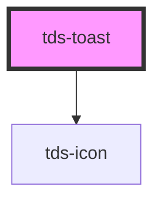

# tds-toast

## Accessibility Notes

### ARIA Live Announcements

The toast component uses `aria-live` to announce its content to screen readers when it appears or changes. However, there is an important behavior to be aware of:

**Initial Render Behavior**: When a toast is initially rendered on the page load, the content may not be announced automatically. This is because many screen readers only announce `aria-live` regions when their content changes after the initial page load.

**How to Ensure Announcements**:

1. If you need the toast to be announced on initial page load, initially render the toast with the `hidden` attribute set to `true`, then use the `showToast()` method to reveal it after a brief delay.

2. For dynamic toasts that appear based on user actions, use the `showToast()` method to make the toast appear, which will trigger the screen reader announcement.

**Example**:

```js
// Initial render - toast is hidden
// Then reveal it after a small delay to trigger announcement
const toast = document.querySelector('tds-toast');
setTimeout(() => {
  toast.showToast();
}, 100);
```

For the most reliable announcements, create toasts dynamically when needed rather than having them pre-rendered but hidden on page load.


<!-- Auto Generated Below -->


## Properties

| Property            | Attribute              | Description                                                 | Type                                                 | Default              |
| ------------------- | ---------------------- | ----------------------------------------------------------- | ---------------------------------------------------- | -------------------- |
| `closable`          | `closable`             | Enables the close button.                                   | `boolean`                                            | `true`               |
| `header`            | `header`               | Header text for the component.                              | `string`                                             | `undefined`          |
| `hidden`            | `hidden`               | Hides the Toast.                                            | `boolean`                                            | `false`              |
| `subheader`         | `subheader`            | Subheader text for the component.                           | `string`                                             | `undefined`          |
| `tdsAriaLive`       | `tds-aria-live`        | ARIA live for the Toast.                                    | `"assertive" \| "polite"`                            | `'polite'`           |
| `tdsCloseAriaLabel` | `tds-close-aria-label` | Provides an accessible name for the components close button | `string`                                             | `undefined`          |
| `toastId`           | `toast-id`             | ID for the Toast. Randomly generated if not specified.      | `string`                                             | `generateUniqueId()` |
| `toastRole`         | `toast-role`           | ARIA role for the Toast.                                    | `"alert" \| "log" \| "status"`                       | `'alert'`            |
| `variant`           | `variant`              | Type of Toast.                                              | `"error" \| "information" \| "success" \| "warning"` | `'information'`      |


## Events

| Event      | Description                                             | Type                                |
| ---------- | ------------------------------------------------------- | ----------------------------------- |
| `tdsClose` | Sends unique Toast identifier when component is closed. | `CustomEvent<{ toastId: string; }>` |


## Methods

### `hideToast() => Promise<void>`

Hides the Toast.

#### Returns

Type: `Promise<void>`


### `showToast() => Promise<void>`

Shows the Toast.

#### Returns

Type: `Promise<void>`


## Slots

| Slot          | Description                                        |
| ------------- | -------------------------------------------------- |
| `"actions"`   | Slot for the Toast bottom section, used for links. |
| `"header"`    | Slot for the Toast header.                         |
| `"subheader"` | Slot for the Toast subheader.                      |


## Dependencies

### Depends on

- [tds-icon](../icon)

### Graph


----------------------------------------------

*Built with [StencilJS](https://stenciljs.com/)*
