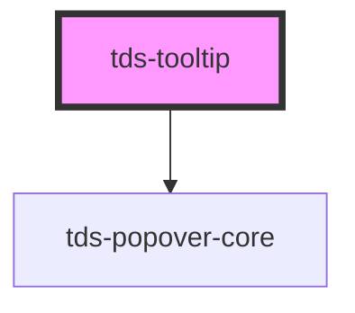

# tds-tooltip


### Usage with @scania/tegel-angular
If you are using the `<tds-toolip>` in an Angular environment and want to
use the `referenceEl` prop rather than the `selector` the referenced element can't be a Tegel component. We recommend wrapping the element in a native HTMLElement and using that as the `referenceEl`. See example below:

```html
<div #myReference>
  <tds-button text="Button"></tds-button>
</div>
<tds-toolip [referenceEl]="myReference">

</tds-toolip>

```

### Usage with @scania/tegel-react
If you are using the `<TdsTooltip>` in an React environment and want to
use the `referenceEl` prop rather than the `selector` the referenced element can't be a Tegel component. We recommend wrapping the element in a native HTMLElement and using that as the `referenceEl`. See example below:

```jsx
<div ref={myReference.current}>
  <TdsButton text="Button"></TdsButton>
</div>
<TdsTooltip referenceEl={myReference}>

</TdsTooltip>

```


<!-- Auto Generated Below -->


## Properties

| Property           | Attribute            | Description                                                                                    | Type                                                                                                                                                                                                         | Default     |
| ------------------ | -------------------- | ---------------------------------------------------------------------------------------------- | ------------------------------------------------------------------------------------------------------------------------------------------------------------------------------------------------------------ | ----------- |
| `defaultOpen`      | `default-open`       | Decides if the component should be visible from the start.                                     | `boolean`                                                                                                                                                                                                    | `false`     |
| `mouseOverTooltip` | `mouse-over-tooltip` | Allow mouse over Tooltip. Useful when Tooltip contains clickable elements like link or button. | `boolean`                                                                                                                                                                                                    | `false`     |
| `offsetDistance`   | `offset-distance`    | Sets the offset distance                                                                       | `number`                                                                                                                                                                                                     | `8`         |
| `offsetSkidding`   | `offset-skidding`    | Sets the offset skidding                                                                       | `number`                                                                                                                                                                                                     | `0`         |
| `placement`        | `placement`          | Placement of Tooltip.                                                                          | `"auto" \| "auto-end" \| "auto-start" \| "bottom" \| "bottom-end" \| "bottom-start" \| "left" \| "left-end" \| "left-start" \| "right" \| "right-end" \| "right-start" \| "top" \| "top-end" \| "top-start"` | `'bottom'`  |
| `referenceEl`      | --                   | Element that will trigger the Tooltip (takes priority over selector)                           | `HTMLElement`                                                                                                                                                                                                | `undefined` |
| `selector`         | `selector`           | The CSS-selector for an element that will trigger the Tooltip                                  | `string`                                                                                                                                                                                                     | `undefined` |
| `show`             | `show`               | Prop in control of showing and hiding prop. Takes precedence over `defaultOpen` prop.          | `boolean`                                                                                                                                                                                                    | `null`      |
| `text`             | `text`               | In case Tooltip contains only text, no HTML, a text can be passed by this prop                 | `string`                                                                                                                                                                                                     | `''`        |
| `trigger`          | `trigger`            | What triggers the popover to show                                                              | `"click" \| "hover"`                                                                                                                                                                                         | `'hover'`   |


## Slots

| Slot          | Description                                    |
| ------------- | ---------------------------------------------- |
| `"<default>"` | <b>Unnamed slot.</b> For the tooltip contents. |


## Dependencies

### Depends on

- [tds-popover-core](../popover-core)

### Graph


----------------------------------------------

*Built with [StencilJS](https://stenciljs.com/)*
