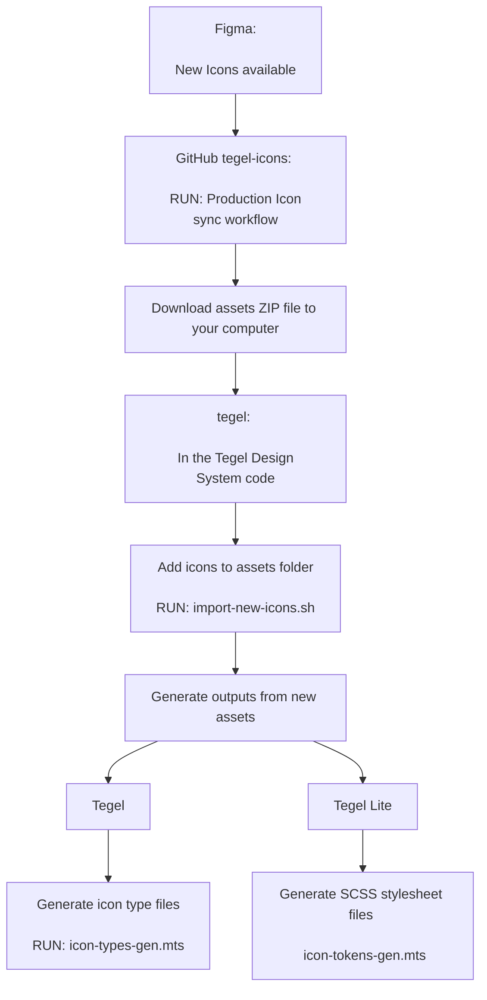

# How to Icons in Tegel

## Purpose

This document tells you all you need to know when new Icon(s) are created for the Tegel Design System.

In summary:

## What is what

### assets/icons/<brand>/*.svg

Runtime source.
These are the SVGs that actually get served/shipped (Storybook static dirs, Stencil copies them into dist, the SCSS references them).
After being copied to the `dist` folder, these files are used by the web component `<tds-icon>`. The component fetches or references the SVG directly as an image/background-image for rendering in the DOM.

### packages/core/src/types/

Type definitions for the icons stored in the `assets` folder.

These files are generated by the `scripts/icon-types-generation.mts` script.

### tokens/scss/<brand>/<brand>>-icons.scss

CSS custom properties are used by Tegel Lite's `<tl-icon>`. Instead of fetching a file, the icon path data is embedded directly in a CSS variable `--icon-name-svg: url("data:image/svg+xml,...")`, so the icon renders purely from CSS as we want Tegel Lite to be CSS only.

These files are generated by the `scripts/icon-token-generation.mts` script.

### icons-gallery.stories.tsx

Storybook story that renders the icons defined by the types.

## What do we need to do?

As the flowchart describes, we need to :

1. Run the [Production Icon Sync workflow](https://github.com/scania-digital-design-system/tegel-icons/actions/workflows/production-icon-sync.yml) to connect to Figma and extract the SVGs into a zip folder
2. Download the assets file
3. Run the [script to unzip and move the svgs to tegel](./import-icons.shscripts/)
4. Run the script to generate the [tokens](./icon-token-generation.mts) and the [types](./icon-types-generation.mts)
5. Commit the newly generated files and assets
6. Get it approved with the PR :)

## Open Points

### GitHub workflow

It would be interesting to have this manual process into a GitHub workflow in the tegel repository.

### Tegel Icons package

The svgs are always packed as a part of Tegel, even if we use only one icon, the application that uses Tegel must serve them all. It would be a good refactor to separate the icons package from Tegel itself and let the consumers install two libs: `@scania/tegel` and `@scania/tegel-icons`.

### Icon component in Storybook

The story for the [icon component](../packages/core/src/components/icon/icon.stories.tsx) uses only the Scania icons. Should it use all the icons?

## Deprecated

There used to be an `icons/` folder in the tegel repository. This folder contained a `gulpfile` that merged paths to be used in the tokens stylesheets.

It forced us to keep the svgs in sync between this `icons` folder and the `assets` folder, which of course could be a problem.
